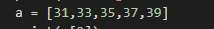
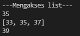

# praktikum4
<h1> Nama           :   Viena Dwi Putri Maulina <h1>
<h1> Nim            :   312110469
<h1> Kelas          :   TI.21.C1
<h1> Mata Kuliah    :   Bahasa Pemrograman <h1>

# Latihan Program list
# Buat sebuah list sebanyak 5 elemen dengan nilai bebas

 Ketik 5 elemen angka bebas seperti berikut

 misal angkanya 31,33,35,37,39 

 dalam akses list ini, urutannya tidak dimulai dari 1, tetapi dari 0. misal 31 adalah urutan 0 ([0]), 33 urutan ke 1 ([1]) dan begitu seterusnya. 

# Akses list
## Tampilkan elemen ke 3

 program ini untuk menampilkan elemen ketiga. bentuk penulisannya (a[2]). 
 

## ambil nilai elemen ke 2 sampai elemen ke 4

 program ini untuk menampilkan elemen ke 2 sampai ke empat. maka bentuk penulisannya (a[1:4])

## ambil nilai terakhir

 program ini untuk mengambil nilai terakhir dengan bentuk penulisan (a[-1]), tanda minus berati urutan nya dari belakang 

 script nya seperti berikut 

maka hasil nya seperti berikut

